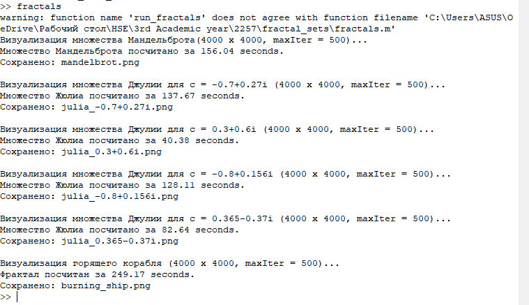
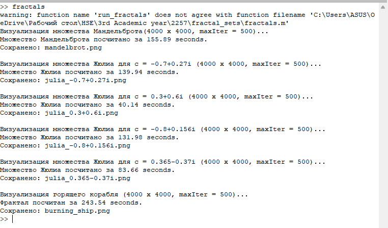

# 
Документация по фракталам

## 
Содержание

- [Введение](#введение)
- [Основная часть](#основная-часть)
    - [Алгоритм для множества Мандельброта](#Функция-renderMandelbrot)
    - [Алгоритм для множеств Жюлия](#Функция-renderJulia)
    - [Алгоритм для горящего корабля](#Функция-renderBurningShip)
- [Запуск](#запуск)

## Введение
Код состоит из одной главной функции run_fractals и трёх вспомогательных  renderMandelbrot, renderJulia, renderBurningShip. Программа создаёт изображения фракталов Мандельброта, Жюлиа и Горящего корабля, используя векторизованные вычисления и плавную раскраску.

## Основная часть 
Главная функция run_fractals задаёт параметры, вызывает функции рендеринга для каждого фрактала, замеряя время с помощью tic/toc, сохраняет изображения в формате PNG с помощью imwrite, выводит информацию о процессе и затраченном времени на каждом этапе. 

### Функция renderMandelbrot
Функция renderMandelbrot генерирует изображение множества Мандельброта. 
Входные параметры:

- width, height – размеры выходного изображения;
- xMin, xMax, yMin, yMax – границы комплексной плоскости;
- maxIter – максимальное число итераций;
- R – радиус убегания;
- cmap – имя цветовой карты.

Алгоритм представлен ниже

Создание сетки комплексных чисел, а именно создаются векторы координат, далее матрицы координат по X и Y, после чего создается комплексная матрица, где каждый элемент  - это параметр c для соответствующего пикселя.

Далее инициализация, то есть создается поле Z - это начальные значения z_0 = 0, далее матрица, хранящая номер итерации, на которой точка «убежала» и логическая маска для точек, уже покинувших радиус. 

Цикл для каждого n от 1 до maxIter - выбираем ещё не убежавшие точки. Обновляем Z(mask) для векторизации. После определяем, какие точки убежали на этой итерации. Запоминаем номер итерации для них, после - добавляем их в общий список убежавших. После чего проверка если all(escaped(:)) – все точки убежали, досрочно выходим из цикла.

Плавная раскраска получается таким образом, что точки, которые никогда не убегали, получают iterCount = maxIter. 
Для убежавших точек вычисляется дробное значение $\mu$ по формуле:
$$
\mu = n + 1 - \frac{\log(\log|z_n|)}{\log2}
$$

где n – номер итерации, на которой точка убежала, $z_n$ – значение перед убеганием. Это даёт непрерывный переход цвета.Затем $\mu$ обрезается до диапазона [0, maxIter] и нормализуется. Гарантируется, что $\mu$ _norm находится в [0,1].

Далее идет преобразование в цветное изображение

### Функция-renderJulia

Функция генерирует изображение множества Жюлиа для заданного параметра c. 
Начальные значения Z берутся из комплексной сетки $Z = X + Y*i $, т.е. $z_0$ соответствует координатам пикселя в отличии от Мандельброта. Параметр c фиксирован (передаётся в функцию). Итерационная формула $Z_{n+1} = {Z_n}^2 + c$. Всё остальное, а именно цикл, маски, плавная раскраска, преобразование в цвет - идентично.

Входные параметры – те же, что и у renderMandelbrot, плюс c (комплексное число).

### Функция-renderBurningShip

Функция renderBurningShip генерирует фрактал Горящий корабль. Особенность – нелинейное отображение с модулями действительной и мнимой частей:

$$
z_{n+1} = \left( |\operatorname{Re}(z_n)| + i |\operatorname{Im}(z_n)| \right)^2 + c
$$

## Запуск 

При первом запуске была цветовая карта jet. В MATLAB/Octave представляет собой спектр от синего через голубой, зелёный, жёлтый до красного.

Рисунок 1: Результаты при раскраске jet 

При втором запуску была использована раскраска hot - от черного через красный к желтому и белому. 

Рисунок 2: Результаты при раскраске hot 
